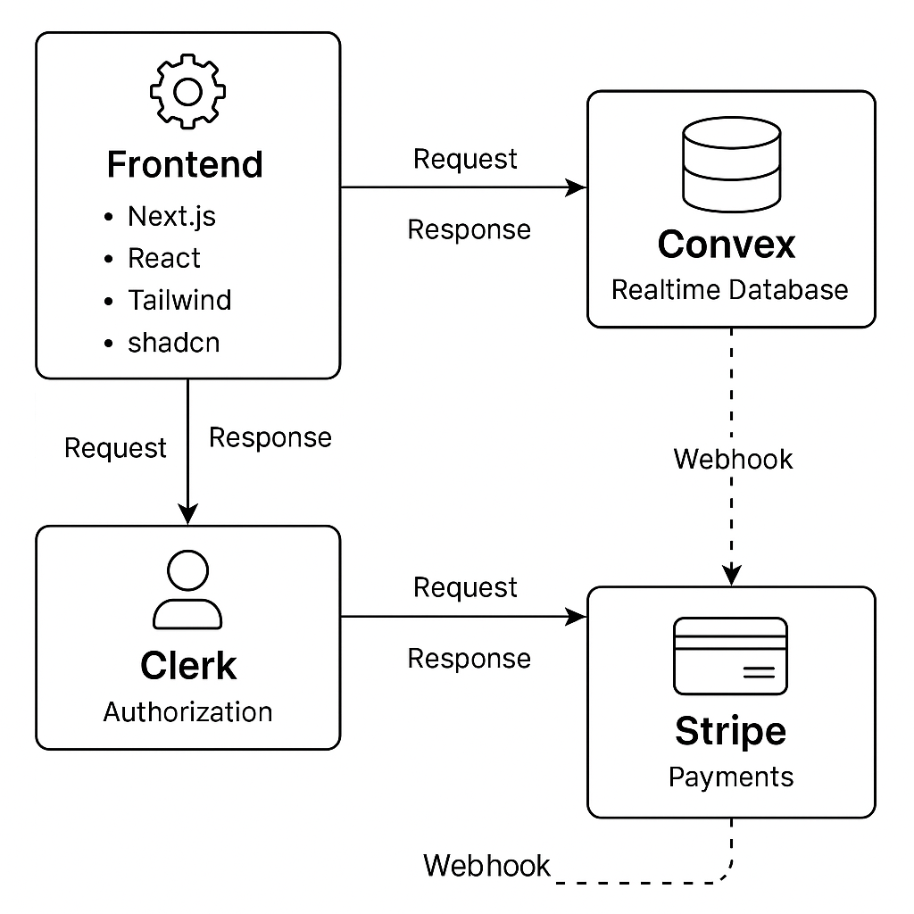

# Ticketing Market

Ticketing Market is a modern web application that allows users to buy and sell tickets for events. The system offers advanced event management features, integration with payment systems, and flexible user management.

## 📌 System Architecture

The application is designed as a modern web system based on a serverless architecture and dynamic data management. Key components:

- **Frontend**: Next.js + React, using Tailwind CSS and shadcn for building the interface.
- **Backend**: Convex - a reactive database that allows real-time updates.
- **Authorization**: Clerk provides secure login and user management.
- **Payments**: Stripe handles financial transactions.
- **Typing**: TypeScript ensures safe and scalable code.

### 📊 Architecture Diagram

Below is a diagram illustrating the dependencies between key components of the application:



## 🚀 Technologies

- **Next.js** – server-side rendering and SEO optimization.
- **React** – dynamic user interfaces.
- **Convex** – scalable database with real-time synchronization capabilities.
- **shadcn** – ready-to-use UI components for consistent look and feel.
- **Tailwind CSS** – flexible styles without writing custom CSS.
- **Clerk** – handles user login and management.
- **Stripe** – payment processing and transactions.
- **TypeScript** – strong typing for greater code stability.

## 🎯 Key Features

### For Users
- Browse and search for events.
- Purchase tickets online using Stripe.
- Register and log in via Clerk.
- Manage purchased tickets.
- Join waiting lists.

### For Event Organizers
- Create events and set ticket prices.
- Manage seat availability.
- View participant lists.
- Monitor transaction statuses.

## 📂 Folder Structure

- **app/** – main application folder containing page logic and Next.js routing. Each file in this folder corresponds to a specific route in the app.
    - **layout.tsx** – main app layout, including navigation.
    - **page.tsx** – homepage of the application.
    - **events/** – pages related to events, e.g., browsing and event details.
    - **tickets/** – pages related to managing purchased tickets.
    - **api/** – API routes handling backend operations (e.g., Stripe webhooks).
- **components/** – reusable components.
- **convex/** – backend functions and database schemas.
- **lib/** – configurations and helper functions.
- **public/** – static assets.

## 📊 Data Structure

The app uses Convex to manage real-time data. Table structure:

- **events** – stores information about events.
- **tickets** – tickets assigned to users.
- **users** – data about application users.
- **waitingList** – list of people waiting for tickets.

## 🛠 Installation and Running

1. **Clone the repository:**
   ```sh
   git clone https://github.com/Fadi-N/ticketing-market.git
2. **Navigate to the project directory:**
   ```sh
   cd ticketing-market
3. **Install dependencies:**
   ```sh
   npm install
4. **Configure environment variables:** Create a `.env.local` file and add the required API keys for Convex, Clerk and Stripe.
   

5. **Run the Convex database:**
   ```sh
   npx convex dev
6. **Run Stripe in webhook listening mode:**
   ```sh
   stripe listen --forward-to localhost:3000/api/webhooks/stripe
7. **Run the app in development mode:**
   ```sh
   npm run dev

The app will be available at http://localhost:3000.
